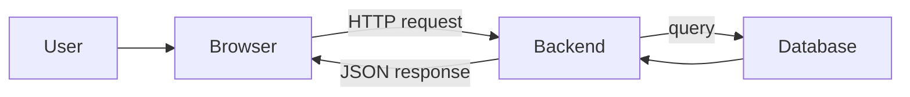
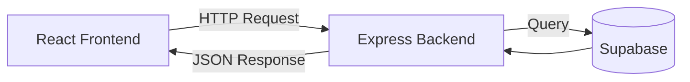

## The backend's job

A website isn't just HTML and CSS. The backend handles everything that happens
behind the scenes:

- Storing and retrieving data (users, posts, products)
- Authentication (login, signup, sessions)
- Business logic (validating input, calculating totals)
- Security (preventing unauthorized access)
- Exposing data through APIs



## What is an API?

An **API** (Application Programming Interface) is a contract between the
frontend and the backend. The frontend asks for something, the backend decides
how to respond.

Think of it like ordering at a restaurant:

- You (the frontend) look at the menu and tell the waiter what you want
- The waiter (the API) takes your order to the kitchen
- The kitchen (the backend) prepares your food
- The waiter brings it back

You don't need to know how the kitchen works — you just need to know the menu
(the API endpoints).

```js
// Frontend asks: "Give me all users"
fetch("https://api.example.com/users")
  .then(res => res.json())
  .then(data => console.log(data));

// Backend responds with:
[
  { "id": 1, "name": "Alex", "email": "alex@example.com" },
  { "id": 2, "name": "Priya", "email": "priya@example.com" }
]
```

## The three layers

Every web application is split into three layers:



### 1. Frontend (Client)

- Runs in the browser
- Renders the UI (HTML, CSS, JavaScript)
- Makes HTTP requests to the backend
- **Example:** A React app showing a list of students

### 2. Backend (Server)

- Runs on a server (your machine during development, a cloud server in production)
- Handles HTTP requests and sends responses
- Validates data, applies business logic
- Talks to the database
- **Example:** An Express.js app with routes like `GET /students`

### 3. Database

- Stores data permanently
- Survives server restarts and crashes
- Handles querying, filtering, and sorting
- **Example:** A PostgreSQL database with a `students` table

## Request / Response lifecycle

Here's what happens step-by-step when someone visits a page that shows student
data:

```
1. Browser loads the page
2. React component calls fetch("/api/students")
3. Browser sends GET request to the backend
4. Express matches the route: app.get("/api/students", handler)
5. Handler queries the database: SELECT * FROM students
6. Database returns rows as JSON
7. Express sends the JSON back to the browser
8. React renders the data in the UI
```

### A real example

```js
// Step 1: Frontend makes a request
const response = await fetch("http://localhost:3000/students");
const students = await response.json();
// students = [{ id: 1, name: "Alex" }, { id: 2, name: "Priya" }]

// Step 2: Backend receives it
app.get("/students", async (req, res) => {
  const { data } = await supabase.from("students").select("*");
  res.json(data);  // sends [{ id: 1, name: "Alex" }, ...]
});
```

## Why do we need a backend?

You might wonder — can't I just store data in the browser? You can (using
`localStorage`), but:

| Browser Storage | Backend + Database |
| --- | --- |
| Only you can see it | Everyone can see shared data |
| Lost if you clear cache | Persists permanently |
| No login/security | Authentication built-in |
| Can't share data | Multiple users, real-time |

A backend is the difference between a static personal tool and a real web
application that multiple people can use.
