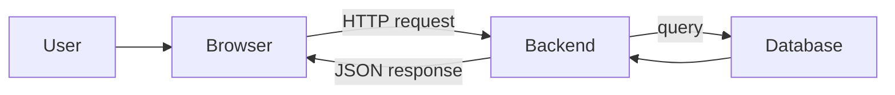

## Goal

By the end of this session you will:

- Understand how a frontend talks to a backend
- Build a small REST API with Express
- Connect that API to a real database (Supabase)
- Realize the backend isn't magic

## Prerequisites

Before starting, make sure you have:

- **Node.js** installed (v18 or later) — [download here](https://nodejs.org)
- A code editor — VS Code recommended
- A free **Supabase** account — [supabase.com](https://supabase.com)
- Postman or Bruno (for testing APIs)

Verify your setup:

```bash
node --version   # should print v18.x.x or higher
npm --version    # should print 9.x.x or higher
```

## What you'll build

A **Student Directory API** — a full CRUD backend that stores student records
(name, email, department) in a real database. By the end you'll have working
endpoints you can hit from Postman, a frontend, or a mobile app.

## Session outline

| Time | Topic |
| --- | --- |
| 0:00 – 0:15 | Backend concepts, HTTP, REST |
| 0:15 – 0:30 | Express basics + routing |
| 0:30 – 0:35 | Middleware |
| 0:35 – 0:50 | Database basics + Supabase |
| 0:50 – 1:20 | Live coding: Student Directory API |
| 1:20 – 1:30 | Assignment + wrap-up |

## How the frontend and backend talk



The browser sends an HTTP request. The backend processes it, talks to the
database if needed, and sends back a response (usually JSON). Every web app you
use follows this same pattern.

## Key terms

| Term | What it means |
| --- | --- |
| **API** | A set of URLs the frontend can call to get or send data |
| **Endpoint** | A specific URL + method combination (e.g. `GET /students`) |
| **JSON** | JavaScript Object Notation — the format APIs send data in |
| **CRUD** | Create, Read, Update, Delete — the four basic operations |
| **Database** | Stores data permanently (so it survives server restarts) |
| **Route** | Maps a URL + method to a handler function |

Let's start with the concepts, then build it piece by piece.
