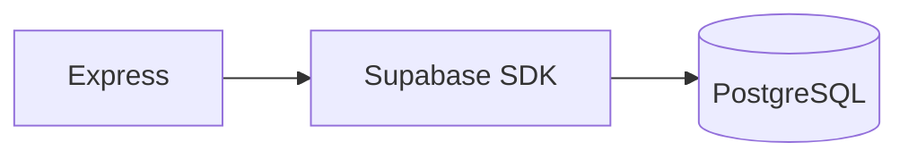

## Why a database?

Without a database, restarting your server wipes all data. Everything lives in
memory, which disappears the moment the process stops.

```js
// Without a database — data dies on restart
let students = [{ id: 1, name: "Alex" }];

app.post("/students", (req, res) => {
  students.push({ id: Date.now(), ...req.body });
  // Works fine... until you restart the server
});
```

A database makes data **persist** across restarts, deploys, and users. Things
like user accounts, blog posts, and products all need to live somewhere
permanent.

## Why Supabase?

Supabase is a managed backend platform that gives you:

- **PostgreSQL database** — a battle-tested, full-featured SQL database
- **Authentication** — email/password, OAuth (Google, GitHub, etc.)
- **File storage** — upload and serve images, documents
- **Web dashboard** — inspect and edit data visually
- **Auto-generated REST API** — instant CRUD from your database schema



For this session, we'll use Supabase as our database. Free tier gives you
everything you need.

## Setting up Supabase

### 1. Create a project

1. Go to [supabase.com](https://supabase.com) and sign up
2. Click **New Project**
3. Fill in: Name, Database Password (save this!), Region
4. Wait ~2 minutes for the database to provision

### 2. Get your credentials

Go to **Project Settings → API** and copy:

- **Project URL** — looks like `https://xxxxx.supabase.co`
- **anon public key** — starts with `eyJ...`

### 3. Create a `.env` file

```bash
# .env
SUPABASE_URL=https://xxxxx.supabase.co
SUPABASE_KEY=eyJhbGciOiJI...
PORT=3000
```

Never commit `.env` to git — add it to `.gitignore`.

### 4. Install the Supabase SDK

```bash
npm install @supabase/supabase-js dotenv
```

### 5. Create the database client

```js
// db/supabase.js
import { createClient } from "@supabase/supabase-js";
import dotenv from "dotenv";
dotenv.config();

export const supabase = createClient(
  process.env.SUPABASE_URL,
  process.env.SUPABASE_KEY
);
```

## Creating a table

You can create tables from the Supabase dashboard or with SQL.

### From the SQL Editor

Go to **SQL Editor** in the Supabase dashboard and run:

```sql
CREATE TABLE students (
  id SERIAL PRIMARY KEY,
  name VARCHAR(100) NOT NULL,
  email VARCHAR(255) UNIQUE NOT NULL,
  department VARCHAR(50),
  created_at TIMESTAMP DEFAULT NOW()
);
```

This creates a `students` table with columns:

| Column | Type | Description |
| --- | --- | --- |
| `id` | SERIAL (auto-increment) | Unique identifier |
| `name` | VARCHAR(100) | Student's name |
| `email` | VARCHAR(255) | Unique email |
| `department` | VARCHAR(50) | Department (CSE, ECE, etc.) |
| `created_at` | TIMESTAMP | When the record was created |

### From the Table Editor

Or use the visual Table Editor:

1. Go to **Table Editor** → **New Table**
2. Name: `students`
3. Add columns: `name` (text), `email` (text), `department` (text)
4. Enable **RLS** (Row Level Security) — we'll configure it next

## Row Level Security (RLS)

RLS controls who can access which rows. For development, create a policy that
allows all operations:

```sql
-- Allow all operations for now (fine for learning)
CREATE POLICY "Allow all" ON students
  FOR ALL USING (true) WITH CHECK (true);
```

## Reading data (SELECT)

```js
import { supabase } from "./db/supabase.js";

// Get all students
app.get("/students", async (req, res) => {
  const { data, error } = await supabase
    .from("students")
    .select("*");

  if (error) return res.status(500).json({ error: error.message });
  res.json(data);
});
```

### Filtering

```js
// Get students from a specific department
const { data } = await supabase
  .from("students")
  .select("*")
  .eq("department", "CSE");

// Get a single student by ID
const { data } = await supabase
  .from("students")
  .select("*")
  .eq("id", 1)
  .single();
```

### Ordering and limiting

```js
// Get the 5 most recent students
const { data } = await supabase
  .from("students")
  .select("*")
  .order("created_at", { ascending: false })
  .limit(5);

// Search by name (case-insensitive)
const { data } = await supabase
  .from("students")
  .select("*")
  .ilike("name", "%alex%");
```

## Writing data (INSERT)

```js
app.post("/students", async (req, res) => {
  const { name, email, department } = req.body;

  // Validate input
  if (!name || !email) {
    return res.status(400).json({ error: "Name and email are required" });
  }

  const { data, error } = await supabase
    .from("students")
    .insert({ name, email, department })
    .select();  // .select() returns the created row

  if (error) {
    // Handle duplicate email
    if (error.code === "23505") {
      return res.status(409).json({ error: "A student with this email already exists" });
    }
    return res.status(500).json({ error: error.message });
  }

  res.status(201).json(data[0]);
});
```

## Updating data (UPDATE)

```js
app.patch("/students/:id", async (req, res) => {
  const { id } = req.params;
  const updates = req.body;

  // Only update fields that were sent
  const { data, error } = await supabase
    .from("students")
    .update(updates)
    .eq("id", id)
    .select();

  if (error) return res.status(500).json({ error: error.message });
  if (!data.length) return res.status(404).json({ error: "Student not found" });

  res.json(data[0]);
});
```

## Deleting data (DELETE)

```js
app.delete("/students/:id", async (req, res) => {
  const { id } = req.params;

  const { error } = await supabase
    .from("students")
    .delete()
    .eq("id", id);

  if (error) return res.status(500).json({ error: error.message });

  res.status(204).end();
});
```

## Complete CRUD example

Putting it all together:

```js
import express from "express";
import cors from "cors";
import { supabase } from "./db/supabase.js";

const app = express();
const PORT = 3000;

app.use(cors());
app.use(express.json());

// READ ALL
app.get("/students", async (req, res) => {
  const { data, error } = await supabase
    .from("students")
    .select("*")
    .order("id");

  if (error) return res.status(500).json({ error: error.message });
  res.json(data);
});

// READ ONE
app.get("/students/:id", async (req, res) => {
  const { data, error } = await supabase
    .from("students")
    .select("*")
    .eq("id", req.params.id)
    .single();

  if (error) return res.status(404).json({ error: "Student not found" });
  res.json(data);
});

// CREATE
app.post("/students", async (req, res) => {
  const { name, email, department } = req.body;
  if (!name || !email) {
    return res.status(400).json({ error: "Name and email required" });
  }

  const { data, error } = await supabase
    .from("students")
    .insert({ name, email, department })
    .select();

  if (error) return res.status(500).json({ error: error.message });
  res.status(201).json(data[0]);
});

// UPDATE
app.patch("/students/:id", async (req, res) => {
  const { data, error } = await supabase
    .from("students")
    .update(req.body)
    .eq("id", req.params.id)
    .select();

  if (error) return res.status(500).json({ error: error.message });
  if (!data.length) return res.status(404).json({ error: "Student not found" });
  res.json(data[0]);
});

// DELETE
app.delete("/students/:id", async (req, res) => {
  const { error } = await supabase
    .from("students")
    .delete()
    .eq("id", req.params.id);

  if (error) return res.status(500).json({ error: error.message });
  res.status(204).end();
});

app.listen(PORT, () => console.log(`Server on http://localhost:${PORT}`));
```

## Testing your API

### With Postman or Bruno

1. **GET** `http://localhost:3000/students` → should return `[]`
2. **POST** `http://localhost:3000/students` with body:
   ```json
   { "name": "Alex", "email": "alex@test.com", "department": "CSE" }
   ```
   → should return the created student with `201`
3. **GET** `http://localhost:3000/students` → should return 1 student
4. **PATCH** `http://localhost:3000/students/1` with body:
   ```json
   { "department": "ECE" }
   ```
   → department should update
5. **DELETE** `http://localhost:3000/students/1` → should return `204`

### With curl

```bash
# Create
curl -X POST http://localhost:3000/students \
  -H "Content-Type: application/json" \
  -d '{"name":"Alex","email":"alex@test.com","department":"CSE"}'

# Read all
curl http://localhost:3000/students

# Update
curl -X PATCH http://localhost:3000/students/1 \
  -H "Content-Type: application/json" \
  -d '{"department":"ECE"}'

# Delete
curl -X DELETE http://localhost:3000/students/1
```

Pattern to remember: **connect → query → handle errors → return result.**
