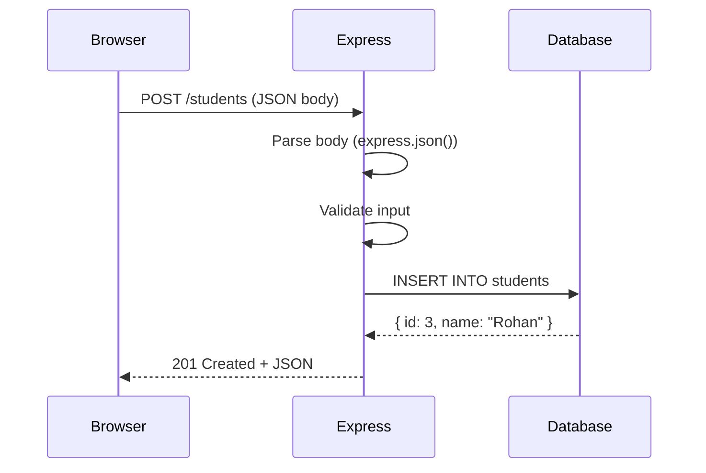

## What is Express?

Express is a **web framework** for Node.js. It simplifies building servers by
handling routing, parsing requests, and sending responses — things you'd have to
write from scratch with Node's built-in `http` module.

```js
// Without Express (raw Node.js)
const http = require("http");
const server = http.createServer((req, res) => {
  if (req.method === "GET" && req.url === "/users") {
    res.writeHead(200, { "Content-Type": "application/json" });
    res.end(JSON.stringify(users));
  }
  // ... dozens more if/else blocks
});

// With Express
app.get("/users", (req, res) => {
  res.json(users);
});
```

## Setting up your first Express server

### Initialize the project

```bash
mkdir backend && cd backend
npm init -y
npm install express
```

### Write the server

Create `server.js`:

```js
import express from "express";

const app = express();
const PORT = 3000;

app.get("/", (req, res) => {
  res.send("Hello Backend!");
});

app.listen(PORT, () => {
  console.log(`Server running at http://localhost:${PORT}`);
});
```

### Run it

```bash
node server.js
# Output: Server running at http://localhost:3000
```

Open `http://localhost:3000` in your browser — you should see "Hello Backend!".

### Auto-restart with --watch

Instead of manually restarting the server after every change:

```bash
node --watch server.js
```

Now any file change automatically restarts the server.

## The Request and Response objects

Every route handler receives two objects:

```js
app.get("/students/:id", (req, res) => {
  // req (request) — everything the client sent
  console.log(req.method);      // "GET"
  console.log(req.url);         // "/students/1"
  console.log(req.params);      // { id: "1" }
  console.log(req.query);       // { sort: "name" }
  console.log(req.body);        // parsed JSON body (requires express.json())
  console.log(req.headers);     // all HTTP headers

  // res (response) — what you send back
  res.status(200);              // set status code
  res.json({ message: "ok" }); // send JSON
  res.send("plain text");      // send text
  res.end();                   // end response with no body
});
```

## Building REST routes

Each route pairs an HTTP method with a URL pattern:

```js
const app = express();
app.use(express.json());  // parse JSON request bodies

// GET — read all students
app.get("/students", (req, res) => {
  res.json([{ id: 1, name: "Alex" }]);
});

// GET — read one student by ID
app.get("/students/:id", (req, res) => {
  const { id } = req.params;
  res.json({ id, name: "Alex" });
});

// POST — create a student
app.post("/students", (req, res) => {
  const { name, email, department } = req.body;

  // Validate the input
  if (!name || !email) {
    return res.status(400).json({ error: "Name and email are required" });
  }

  // In a real app, you'd insert into a database here
  const newStudent = { id: Date.now(), name, email, department };
  res.status(201).json(newStudent);
});

// PATCH — update a student
app.patch("/students/:id", (req, res) => {
  const { id } = req.params;
  const updates = req.body;

  // Validate: at least one field to update
  if (Object.keys(updates).length === 0) {
    return res.status(400).json({ error: "No fields to update" });
  }

  res.json({ id, ...updates, message: "Updated" });
});

// DELETE — remove a student
app.delete("/students/:id", (req, res) => {
  const { id } = req.params;
  res.status(204).end();
});
```

## Route parameters

The `:paramName` syntax captures dynamic parts of the URL:

```js
app.get("/users/:userId/posts/:postId", (req, res) => {
  console.log(req.params.userId);   // from /users/42/posts/7 → "42"
  console.log(req.params.postId);   // "7"
});
```

## Request lifecycle



Every request follows the same shape: **request in → parse → validate → database
→ response out**.

## Organizing routes with Express Router

As your app grows, putting all routes in `server.js` becomes messy. Express
Router lets you split routes into separate files:

```js
// routes/students.js
import { Router } from "express";
const router = Router();

router.get("/", async (req, res) => {
  // GET /students
});

router.post("/", async (req, res) => {
  // POST /students
});

router.patch("/:id", async (req, res) => {
  // PATCH /students/:id
});

router.delete("/:id", async (req, res) => {
  // DELETE /students/:id
});

export default router;
```

```js
// server.js
import express from "express";
import studentsRouter from "./routes/students.js";

const app = express();
app.use(express.json());

app.use("/students", studentsRouter);

app.listen(3000);
```

## Error handling

Always check for errors and return appropriate responses:

```js
app.get("/students", async (req, res) => {
  try {
    const { data, error } = await supabase.from("students").select("*");

    if (error) throw error;

    res.json(data);
  } catch (err) {
    console.error("Error fetching students:", err.message);
    res.status(500).json({ error: "Failed to fetch students" });
  }
});
```

A global error handler at the end of your routes catches anything unhandled:

```js
app.use((err, req, res, next) => {
  console.error(err.stack);
  res.status(500).json({ error: "Something went wrong!" });
});
```

## CORS — letting the frontend talk to the backend

By default, browsers block requests from one origin (e.g. `localhost:5173` for a
React app) to another (`localhost:3000` for the backend). Install CORS to fix
this:

```bash
npm install cors
```

```js
import cors from "cors";

app.use(cors());  // allow all origins (fine for development)
```

For production, restrict to your actual frontend domain:

```js
app.use(cors({ origin: "https://myapp.com" }));
```
