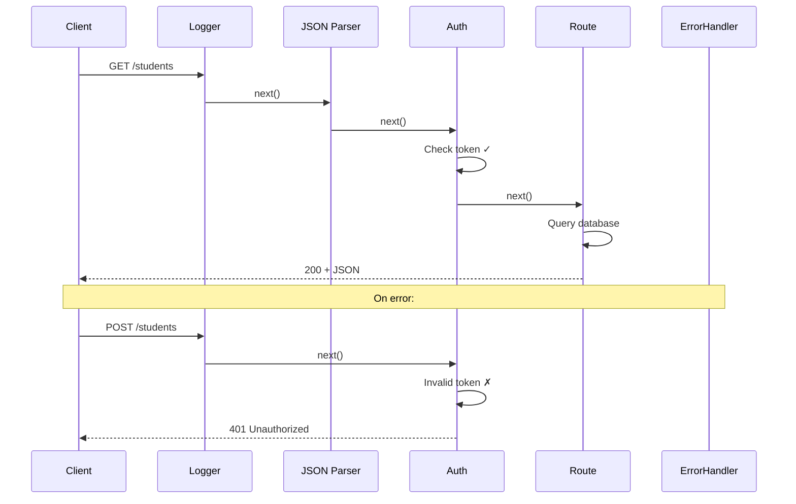

## What middleware does

Middleware functions sit between the incoming request and the final route
handler — think of them as **checkpoints** a request passes through.


Each middleware can:

- **Run code** (log, time, inspect)
- **Modify the request or response** (add properties, set headers)
- **End the request** (return an error early)
- **Pass control** to the next middleware with `next()`

## The middleware function signature

```js
function middlewareName(req, res, next) {
  // Do something with req or res
  console.log(`${req.method} ${req.url}`);

  // Pass to the next middleware or route handler
  next();
}
```

If you don't call `next()`, the request hangs forever. If you call `next(error)`,
it skips to the error handler.

## Built-in middleware

Express comes with essential middleware built in:

### express.json() — Parse JSON bodies

Without this, `req.body` is `undefined` for POST/PATCH requests:

```js
app.use(express.json());

app.post("/students", (req, res) => {
  console.log(req.body);       // { name: "Alex", email: "alex@..." }
  console.log(req.body.name);  // "Alex"
});
```

### express.urlencoded() — Parse form data

For HTML form submissions:

```js
app.use(express.urlencoded({ extended: true }));
```

### express.static() — Serve static files

Serve images, CSS, or a built frontend:

```js
app.use(express.static("public"));

// Now http://localhost:3000/logo.png serves public/logo.png
```

## Custom middleware examples

### Logger — log every request

```js
function logger(req, res, next) {
  const start = Date.now();

  // Log when the response finishes
  res.on("finish", () => {
    const duration = Date.now() - start;
    console.log(`${req.method} ${req.url} → ${res.statusCode} (${duration}ms)`);
  });

  next();
}

app.use(logger);
```

Output:
```
GET /students → 200 (34ms)
POST /students → 201 (52ms)
DELETE /students/1 → 204 (18ms)
```

### Request timer — add timing information

```js
function timer(req, res, next) {
  req.startTime = Date.now();
  next();
}

app.use(timer);

app.get("/students", (req, res) => {
  const elapsed = Date.now() - req.startTime;
  res.json({ data: [], serverTime: `${elapsed}ms` });
});
```

### Authentication check — protect routes

```js
function requireAuth(req, res, next) {
  const token = req.headers.authorization;

  if (!token) {
    return res.status(401).json({ error: "No token provided" });
  }

  if (token !== "secret-token-123") {
    return res.status(403).json({ error: "Invalid token" });
  }

  // Attach user info for the route handler to use
  req.user = { id: 1, name: "Admin" };
  next();
}

// Apply to ALL /admin routes
app.use("/admin", requireAuth);

// Or apply to specific routes only
app.post("/students", requireAuth, (req, res) => {
  console.log(req.user.name);  // "Admin"
  res.status(201).json({ created: true });
});
```

### Input validator — reject bad data early

```js
function validateStudent(req, res, next) {
  const { name, email } = req.body;

  if (!name || name.trim().length === 0) {
    return res.status(400).json({ error: "Name is required" });
  }

  if (!email || !email.includes("@")) {
    return res.status(400).json({ error: "Valid email is required" });
  }

  next();
}

// Only runs on POST /students
app.post("/students", validateStudent, (req, res) => {
  // If we reach here, name and email are valid
  res.status(201).json(req.body);
});
```

### Rate limiter — prevent abuse

A simple per-IP rate limiter in under 20 lines:

```js
const requestCounts = new Map();

function rateLimiter(maxRequests = 10, windowMs = 60000) {
  return (req, res, next) => {
    const ip = req.ip;
    const now = Date.now();

    if (!requestCounts.has(ip)) {
      requestCounts.set(ip, []);
    }

    // Remove old entries outside the window
    const timestamps = requestCounts.get(ip)
      .filter(t => now - t < windowMs);

    if (timestamps.length >= maxRequests) {
      return res.status(429).json({
        error: "Too many requests. Try again later."
      });
    }

    timestamps.push(now);
    requestCounts.set(ip, timestamps);
    next();
  };
}

// Allow 5 requests per minute per IP
app.use("/api", rateLimiter(5, 60000));
```

## Applying middleware

Three ways to apply middleware:

```js
// 1. Global — runs on every request
app.use(logger);
app.use(express.json());

// 2. Route-specific — runs on a URL pattern
app.use("/api", requireAuth);

// 3. Inline — runs on one specific route
app.get("/students", requireAuth, validateQuery, (req, res) => {
  // handler
});
```

## The middleware flow



## Third-party middleware

Install popular middleware packages instead of writing your own:

```bash
npm install cors helmet morgan
```

```js
import cors from "cors";
import helmet from "helmet";
import morgan from "morgan";

app.use(cors());                              // enable CORS
app.use(helmet());                            // security headers
app.use(morgan("dev"));                       // request logging

// morgan output:
// GET /students 200 12.345 ms - 234
// POST /students 201 45.678 ms - 89
```
